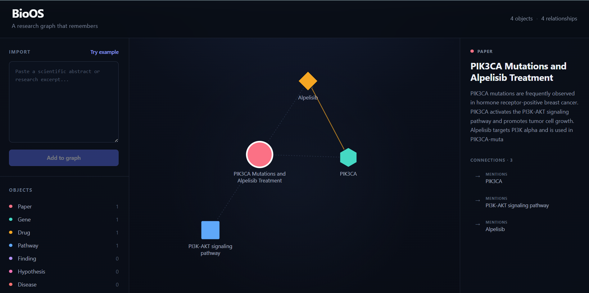
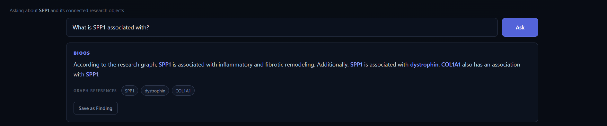

# BioOS

### A research graph that remembers.

BioOS is a local-first research workspace that transforms scientific text into a persistent, queryable knowledge graph.

Instead of treating every interaction as an isolated chat, BioOS extracts structured research objects — such as genes, drugs, diseases, pathways, findings, and hypotheses — connects them through relationships, and allows researchers to query the resulting graph using natural language.

> **From scientific text → structured research objects → connected knowledge → graph-grounded answers.**

## See BioOS in action

### Build a research graph from scientific text

<p align="center">
  
</p>

BioOS turns unstructured scientific text into an interactive research graph.

A researcher can paste a scientific abstract or research excerpt, and BioOS will:

- **Extract research objects** including genes, drugs, diseases, pathways, findings, hypotheses, and papers.
- **Identify relationships** between those objects, such as a drug targeting a gene.
- **Build a persistent knowledge graph** where information from multiple research excerpts can accumulate.
- **Reuse existing objects** when the same entity appears across different sources.
- **Explore connections interactively** by selecting objects and inspecting their summaries and relationships.

### Ask questions over the research graph

<p align="center">
  
</p>

BioOS also provides a natural-language interface over the accumulated graph. Questions are answered using the research objects and relationships already stored in the workspace, with the relevant graph objects surfaced alongside the answer.

Useful answers can be saved back into the graph as **Findings**, allowing the research workspace to grow as it is explored.

## Why BioOS?

Scientific research is cumulative, but most AI-assisted research workflows are conversational.

A chat interface can help summarize a paper or answer a question, but the useful knowledge generated during that interaction often remains trapped inside the conversation. As more papers are read, researchers must repeatedly reconstruct context, remember connections, and track how genes, drugs, pathways, diseases, and findings relate across sources.

BioOS explores a different model: **research as a persistent graph rather than a sequence of isolated conversations.**

Each imported research excerpt contributes structured objects and relationships to a shared workspace. When an entity appears again, BioOS can reuse the existing object rather than treating it as entirely new information. Over time, individual excerpts become part of a connected representation of the research landscape.

This enables a workflow where researchers can move from:

**reading → extraction → connection → exploration → questioning → new findings**

while preserving the accumulated research context.

## Core Features

- **Scientific entity extraction** — Converts unstructured research text into typed objects such as Genes, Drugs, Diseases, Pathways, Findings, and Hypotheses.

- **Relationship extraction** — Identifies explicit relationships between extracted objects and represents them as graph edges.

- **Persistent research graph** — Accumulates objects and relationships across multiple imports instead of discarding context after each interaction.

- **Entity reuse and deduplication** — Recognizes previously stored entities and reuses them when they appear in new research excerpts.

- **Interactive graph exploration** — Visualizes research objects as a connected graph with type-specific nodes, selectable objects, and relationship inspection.

- **Graph-grounded question answering** — Answers natural-language questions using the objects and relationships present in the research graph.

- **Graph references** — Surfaces the research objects used in an answer so users can trace responses back to graph context.

- **Finding creation** — Allows useful answers generated during exploration to be saved back into the graph as new Findings.

- **Local LLM inference** — Uses Ollama for local model execution, keeping the core extraction and question-answering workflow locally runnable.

- **Evaluation notebooks** — Includes reproducible experiments for entity/relationship extraction and multi-document graph construction.

## How BioOS Works

BioOS uses a simple pipeline that converts scientific text into persistent, queryable research context.

```text
Scientific Text
      │
      ▼
┌─────────────────┐
│  React Frontend │
└────────┬────────┘
         │
         ▼
┌─────────────────┐
│ FastAPI Backend │
└────────┬────────┘
         │
         ▼
┌─────────────────┐
│  Ollama + LLM   │
└────────┬────────┘
         │
         ▼
 Structured Extraction
 ┌───────────────┐
 │ Objects       │
 │ Relationships │
 └───────┬───────┘
         │
         ▼
┌─────────────────┐
│ Research Graph  │
└────────┬────────┘
         │
         ├──────────────► Interactive Graph Exploration
         │
         └──────────────► Graph-Grounded Question Answering
```

### 1. Import scientific text

The user provides a scientific abstract or research excerpt through the React interface.

### 2. Extract research objects

The FastAPI backend sends the text to a locally running LLM through Ollama. The model converts the unstructured text into structured research objects and relationships.

Objects can include:

`Paper` · `Gene` · `Drug` · `Pathway` · `Disease` · `Finding` · `Hypothesis`

### 3. Build the research graph

Extracted objects are added to the graph. Existing entities can be reused when they appear in later imports, allowing knowledge from multiple excerpts to accumulate rather than creating an isolated graph for every document.

Relationships form edges between objects, producing a connected representation of the imported research.

### 4. Explore the graph

The frontend visualizes the resulting network. Selecting a node reveals its type, summary, and connections while highlighting its local neighborhood in the graph.

### 5. Ask the graph

Users can ask natural-language questions about a selected object and its connected research context.

Rather than answering from an isolated prompt alone, BioOS supplies relevant graph context to the model and surfaces the graph objects referenced in the generated answer.

### 6. Turn answers into research objects

Useful answers can be saved as **Findings**, allowing insights generated during graph exploration to become part of the persistent research workspace.

## Tech Stack

### Frontend

- **React** — component-based user interface
- **Vite** — frontend development and build tooling
- **D3.js** — interactive force-directed research graph visualization
- **JavaScript / CSS** — application logic and interface styling

### Backend

- **FastAPI** — REST API for extraction and graph-grounded question answering
- **Python** — backend processing and evaluation
- **Pydantic** — validation of structured research objects, relationships, and API responses
- **Requests** — communication with the local Ollama server

### Local AI

- **Ollama** — local LLM inference
- **Gemma 3 4B (`gemma3:4b`)** — biomedical entity/relationship extraction and graph-grounded reasoning

### Evaluation & Analysis

- **Jupyter Notebook**
- **Pandas**
- **NetworkX**
- **Matplotlib**

---

## Project Structure

```text
BioOS/
│
├── backend/
│   ├── app.py
│   ├── extraction.py
│   ├── reasoning.py
│   ├── retrieval.py
│   └── schemas.py
│
├── frontend/
│   ├── src/
│   │   ├── api/
│   │   ├── components/
│   │   ├── app.jsx
│   │   └── main.jsx
│   ├── index.html
│   ├── package.json
│   └── vite.config.js
│
├── notebooks/
│   ├── 01_bioos_evaluation.ipynb
│   └── 02_research_graph_demo.ipynb
│
├── examples/
│   └── sample_research_notes.md
│
├── assets/
│   ├── bioos_graph.png
│   └── bioos_ask.png
│
├── .env.example
├── .gitignore
├── requirements.txt
└── README.md
```

### Repository Components

**`backend/`** contains the FastAPI application, structured extraction pipeline, graph-context retrieval logic, response schemas, and local LLM reasoning layer.

**`frontend/`** contains the React application used to import research text, visualize the accumulated graph, inspect research objects, and ask graph-grounded questions.

**`notebooks/`** contains reproducible evaluation and demonstration workflows. The first notebook evaluates extraction performance, while the second demonstrates multi-excerpt graph accumulation and grounded question answering.

**`examples/`** provides sample scientific text that can be used to test BioOS without sourcing additional material.

**`assets/`** contains screenshots used to document the BioOS interface and workflow.

## Installation & Setup

BioOS runs locally using a FastAPI backend, React/Vite frontend, and an Ollama-hosted language model.

### Prerequisites

Make sure the following are installed:

- **Python 3.10+**
- **Node.js and npm**
- **Ollama**
- **Git**

### 1. Clone the repository

```bash
git clone <YOUR-BIOOS-GITHUB-URL>
cd BioOS
```

Replace `<YOUR-BIOOS-GITHUB-URL>` with the repository URL after publishing the project.

### 2. Create a Python virtual environment

From the BioOS root directory:

**Windows**

```powershell
py -m venv .venv
.venv\Scripts\activate
```

**macOS / Linux**

```bash
python3 -m venv .venv
source .venv/bin/activate
```

### 3. Install backend dependencies

```bash
pip install -r requirements.txt
```

### 4. Install and prepare Ollama

BioOS uses a locally running Ollama model for extraction and graph-grounded reasoning.

Pull the default model:

```bash
ollama pull gemma3:4b
```

Verify that the model is available:

```bash
ollama list
```

BioOS uses `gemma3:4b` by default, but the model can be changed through the environment configuration.

### 5. Configure environment variables

Copy the provided environment template:

**Windows PowerShell**

```powershell
Copy-Item .env.example .env
```

**macOS / Linux**

```bash
cp .env.example .env
```

The default configuration is:

```dotenv
BIOOS_HOST=127.0.0.1
BIOOS_PORT=8000

OLLAMA_URL=http://localhost:11434/api/chat
OLLAMA_MODEL=gemma3:4b

VITE_API_BASE_URL=http://127.0.0.1:8000
```

The `.env` file contains the local configuration and is excluded from version control. `.env.example` provides the configuration template used by the repository.

### 6. Start the backend

Open a terminal and navigate to the backend directory:

```bash
cd backend
```

Start the FastAPI development server:

```bash
python -m uvicorn app:app --reload
```

On Windows, this can also be run with:

```powershell
py -m uvicorn app:app --reload
```

The backend will be available at:

```text
http://127.0.0.1:8000
```

FastAPI's interactive API documentation is available at:

```text
http://127.0.0.1:8000/docs
```

Keep this terminal running.

### 7. Install frontend dependencies

Open a second terminal and navigate to the frontend directory:

```bash
cd frontend
```

Install the dependencies:

```bash
npm install
```

If Windows PowerShell prevents `npm.ps1` from running because of the local execution policy, use:

```powershell
npm.cmd install
```

### 8. Start the frontend

```bash
npm run dev
```

Or, when using `npm.cmd` on Windows:

```powershell
npm.cmd run dev
```

Vite will display the local development URL, typically:

```text
http://localhost:5173
```

Open this address in your browser to launch BioOS.

### 9. Test the application

Paste a scientific excerpt into the import panel, for example:

```text
Duchenne muscular dystrophy is caused by loss of dystrophin. DMD skeletal muscle shows increased expression of SPP1 and COL1A1. SPP1 is associated with inflammatory and fibrotic remodeling.
```

Run the extraction and inspect the resulting research objects in the graph.

You can then select an object and use **Ask BioOS** to query the graph-grounded research context.

> **Note:** BioOS performs inference locally. Extraction and question-answering latency therefore depends on the selected Ollama model and available hardware.

## API

BioOS exposes a small REST API through FastAPI. Interactive documentation is available at `http://127.0.0.1:8000/docs` while the backend is running.

### Extract Research Objects

**`POST /api/extract`**

Converts scientific text into structured biomedical objects and relationships.

#### Example request

```json
{
  "text": "Duchenne muscular dystrophy is caused by loss of dystrophin. DMD skeletal muscle shows increased expression of SPP1 and COL1A1. SPP1 is associated with inflammatory and fibrotic remodeling."
}
```

#### Example response

```json
{
  "title": "DMD Pathology and SPP1 Expression",
  "objects": [
    {
      "tempId": "o1",
      "type": "Disease",
      "name": "Duchenne muscular dystrophy",
      "summary": "A genetic disorder characterized by progressive muscle degeneration."
    },
    {
      "tempId": "o2",
      "type": "Gene",
      "name": "dystrophin",
      "summary": "A protein essential for maintaining muscle cell integrity."
    },
    {
      "tempId": "o3",
      "type": "Gene",
      "name": "SPP1",
      "summary": "A gene associated with inflammatory and fibrotic processes."
    },
    {
      "tempId": "o4",
      "type": "Gene",
      "name": "COL1A1",
      "summary": "A gene encoding a major component of connective tissue."
    }
  ],
  "relationships": [
    {
      "from": "o3",
      "to": "o1",
      "type": "ASSOCIATED_WITH"
    }
  ]
}
```

The extraction API identifies the following object types from scientific text:

`Gene` · `Drug` · `Pathway` · `Finding` · `Hypothesis` · `Disease`

Each imported excerpt is additionally represented in the research graph as a `Paper` object, providing a source node that connects extracted research objects to their originating text.

Supported relationship types include:

`SUPPORTS` · `CONTRADICTS` · `ASSOCIATED_WITH` · `MEASURES` · `TARGETS` · `PART_OF`

---

### Ask the Research Graph

**`POST /api/ask`**

Answers a natural-language question using the supplied research graph as context.

#### Example request

```json
{
  "question": "What is SPP1 associated with?",
  "nodes": [
    {
      "id": "n1",
      "type": "Gene",
      "name": "SPP1",
      "summary": "SPP1 expression is increased in DMD skeletal muscle."
    },
    {
      "id": "n2",
      "type": "Pathway",
      "name": "Fibrotic remodeling",
      "summary": "Extracellular matrix remodeling observed in DMD skeletal muscle."
    },
    {
      "id": "n3",
      "type": "Disease",
      "name": "Duchenne muscular dystrophy",
      "summary": "A progressive muscle disease caused by loss of dystrophin."
    }
  ],
  "edges": [
    {
      "id": "e1",
      "source": "n1",
      "target": "n2",
      "type": "ASSOCIATED_WITH"
    },
    {
      "id": "e2",
      "source": "n1",
      "target": "n3",
      "type": "ASSOCIATED_WITH"
    }
  ],
  "selected_node_id": "n1"
}
```

#### Example response

```json
{
  "answer": "According to the research graph, [[SPP1]] is associated with [[Fibrotic remodeling]] and [[Duchenne muscular dystrophy]].",
  "referenced": [
    "SPP1",
    "Fibrotic remodeling",
    "Duchenne muscular dystrophy"
  ]
}
```

The reasoning model is instructed to answer only from the supplied graph context. Object names referenced in an answer are returned separately in `referenced`, allowing the frontend to connect generated answers back to research objects.

## Evaluation

BioOS includes a lightweight evaluation suite in [`notebooks/01_bioos_evaluation.ipynb`](notebooks/01_bioos_evaluation.ipynb) to measure the behavior of the local extraction pipeline.

The benchmark uses manually curated biomedical excerpts containing expected genes, drugs, diseases, pathways, and relationships.

### Entity Extraction

| Metric | Score |
|---|---:|
| Precision | **1.000** |
| Recall | **0.692** |
| F1 Score | **0.818** |

Performance varied substantially across biomedical object types:

| Object Type | Precision | Recall | F1 |
|---|---:|---:|---:|
| Gene | 1.000 | 1.000 | 1.000 |
| Drug | 1.000 | 1.000 | 1.000 |
| Pathway | 1.000 | 0.400 | 0.571 |
| Disease | 1.000 | 0.167 | 0.286 |

The baseline extractor showed **high precision but conservative recall**. Genes and drugs were recovered reliably in the benchmark, while diseases and pathways accounted for all observed entity false negatives.

No unexpected entities were produced in the evaluated cases.

### Relationship Extraction

A separate set of explicit biomedical relationships was used to evaluate graph-edge extraction.

| Metric | Score |
|---|---:|
| Precision | **1.000** |
| Recall | **0.800** |
| F1 Score | **0.889** |

Four of five expected relationships were recovered.

The single missed relationship was:

```text
PIK3CA → ACTIVATES → PI3K-AKT signaling pathway
```

Failure analysis showed that `PIK3CA` was extracted but the `PI3K-AKT signaling pathway` object was not. The missing edge was therefore caused by an **upstream entity-extraction failure**, rather than an incorrect relationship classification.

### What the evaluation revealed

The current prototype favors precision over graph completeness. This is a useful property for a research graph, where unsupported objects and relationships can be particularly misleading, but low recall also limits how connected the resulting graph can become.

The most important current extraction weakness is the recognition of **Disease** and **Pathway** objects. Improving entity recall in these categories would also improve downstream relationship coverage and graph connectivity.

> **Note:** This is a small, manually curated engineering benchmark designed to characterize the current prototype. The reported metrics should not be interpreted as performance on a comprehensive biomedical information-extraction benchmark.

---

## End-to-End Research Graph Demonstration

[`notebooks/02_research_graph_demo.ipynb`](notebooks/02_research_graph_demo.ipynb) demonstrates the complete BioOS workflow across multiple scientific excerpts.

Five related excerpts were processed independently and accumulated into a shared research graph:

```text
Scientific excerpts
        ↓
Structured extraction
        ↓
Entity resolution
        ↓
Persistent research graph
        ↓
Graph-grounded question answering
```

Across the demonstration, **7 extracted object mentions were resolved into 6 unique persistent research objects**.

`PIK3CA` appeared independently in two excerpts and was correctly reused as a single persistent node while retaining both sources as provenance.

The accumulated graph was then queried with:

> **What drug in the research graph targets PIK3CA?**

BioOS returned:

> The research graph indicates that [[Alpelisib]] targets [[PIK3CA]].

Both referenced objects were present in the supplied graph context, demonstrating the full pipeline from independent scientific excerpts to accumulated, queryable research knowledge.

## Current Limitations

BioOS is currently a prototype designed to explore persistent graph-based research workflows with local language models. Several limitations remain.

### Extraction recall

The current `gemma3:4b` extraction pipeline is conservative. Evaluation showed strong extraction of genes and drugs but substantially lower recall for diseases and pathways.

Because relationships can only be created between successfully extracted objects, missed entities also reduce downstream graph connectivity.

### Entity resolution

Entity reuse currently relies primarily on normalized object names and types. This handles exact repeated entities such as `PIK3CA`, but does not fully resolve aliases, synonyms, abbreviations, or ontology-equivalent concepts.

For example, a production system should be able to determine when different surface forms refer to the same biomedical concept.

### Local model limitations

BioOS intentionally uses a relatively small locally hosted language model to keep the application accessible and local-first.

Extraction quality and inference latency therefore depend on the selected Ollama model and available hardware. More capable models may improve extraction and reasoning at the cost of additional computational requirements.

### Graph persistence

The current prototype focuses on the research-graph workflow itself rather than a production graph database. A larger deployment would benefit from durable graph storage, indexing, richer provenance tracking, and scalable retrieval.

### Biomedical validation

Extracted claims are grounded in user-provided research text, but BioOS does not currently perform external verification against biomedical databases or ontologies.

Researchers should therefore treat extracted objects and generated findings as research-assistance outputs rather than independently validated scientific evidence.

---

## Future Work

Several extensions could turn the current prototype into a more capable biomedical research workspace:

- **Ontology-aware entity resolution** using resources such as HGNC, MeSH, Disease Ontology, ChEBI, or UniProt identifiers.
- **Improved disease and pathway extraction** through prompt refinement, model comparison, or specialized biomedical information-extraction models.
- **Persistent graph storage** using a graph database or dedicated graph persistence layer.
- **Richer provenance tracking** linking individual objects and relationships to their originating papers, excerpts, and evidence.
- **PDF and literature ingestion** for extracting research objects directly from scientific papers.
- **Semantic graph retrieval** for finding relevant research objects beyond immediate graph neighbors.
- **Contradiction and evidence tracking** to represent conflicting findings across papers.
- **Graph-assisted hypothesis generation** using accumulated findings and relationships while preserving evidence provenance.
- **Larger biomedical benchmarks** for systematic evaluation of entity extraction, relationship extraction, and grounded question answering.

The long-term goal is not to replace scientific reading or judgment, but to provide a structured layer where research knowledge can **persist, connect, and remain queryable as the literature grows**.

---

## Author

**Ria Patil**

B.Tech, Pharmaceutical Engineering and Technology  
Indian Institute of Technology (BHU), Varanasi

BioOS was built as an exploration of local language models, biomedical information extraction, knowledge graphs, and graph-grounded research workflows.

---

## License

This project is licensed under the MIT License. See [`LICENSE`](LICENSE) for details.